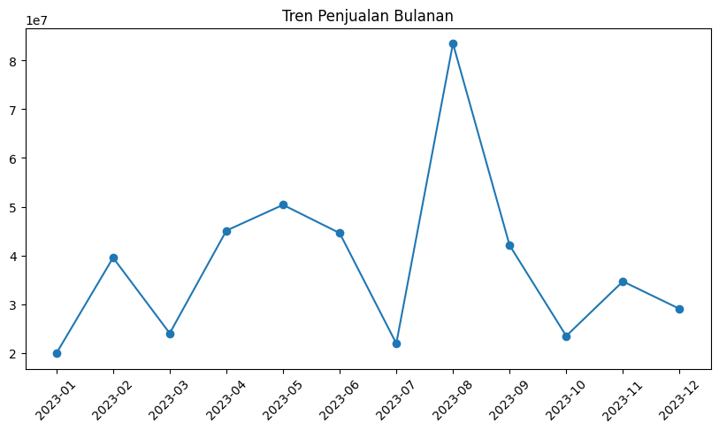
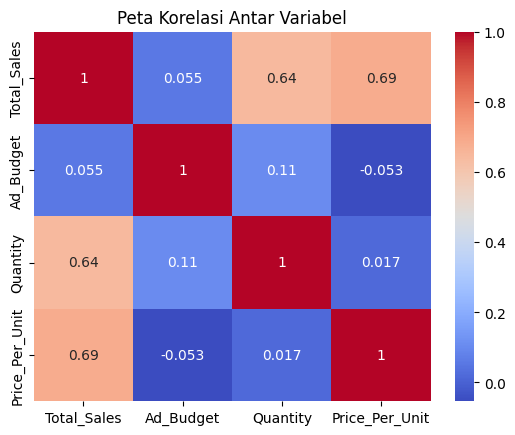

# 📊 Praktikum Analisis Performa Penjualan E-Commerce

# TUGAS MANDIRI
---
## 👤 Identitas
Nama: Kalilah Raihanna Rizky Arafah 
No. : 24
Kelas: XI RPL 1 

## 📌 Business Understanding

### 🎯 Tujuan
Melakukan analisis data penjualan e-commerce untuk memahami pola penjualan serta faktor yang memengaruhi performa penjualan.

### ❓ Business Questions & Answers

1. Bagaimana tren penjualan bulanan?  
Penjualan menunjukkan pola fluktuatif setiap bulan, dengan peningkatan signifikan pada pertengahan tahun dan mencapai puncaknya pada bulan Agustus. Setelah itu, penjualan kembali mengalami penurunan.

2. Apakah Ad_Budget berpengaruh terhadap Total_Sales?  
Berdasarkan hasil analisis korelasi (heatmap), Ad_Budget memiliki hubungan yang sangat lemah terhadap Total_Sales. Hal ini menunjukkan bahwa peningkatan anggaran iklan tidak secara signifikan meningkatkan penjualan.

3. Faktor apa yang paling memengaruhi penjualan?  
Faktor yang paling memengaruhi Total_Sales adalah Quantity dan Price_Per_Unit, karena keduanya memiliki nilai korelasi yang lebih tinggi dibandingkan variabel lainnya.

---

### 📊 Bukti Visualisasi

#### Tren Penjualan

#### Korelasi

